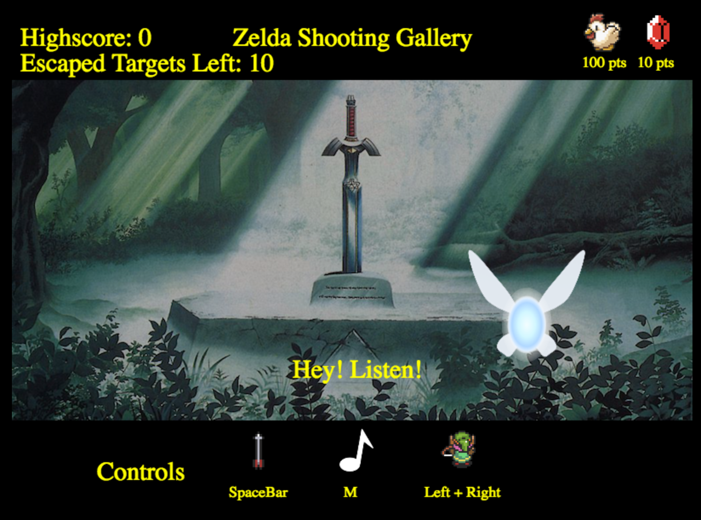
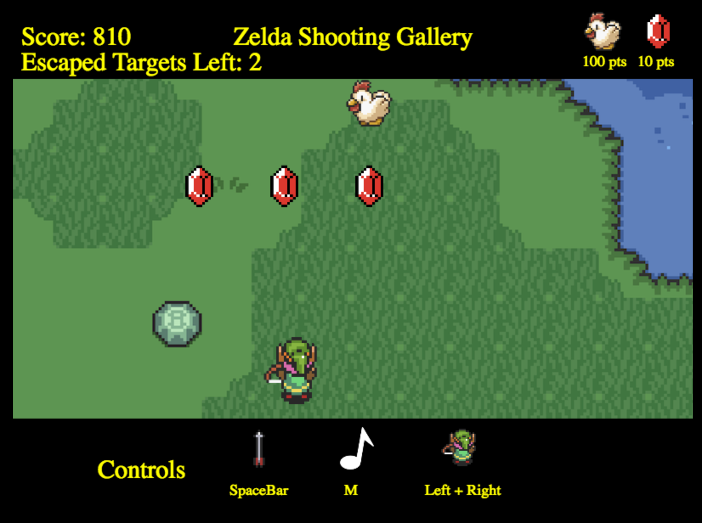

## ZeldaShooter

[zeldashooter demo](https://spookybit.github.io/zeldashooter/)



### Instructions
The goal of ZeldaShooter is to score as many points as possible by shooting the Rupees and Cuccos. Rupees are worth 10 points, and Cuccos are worth 100 points. Failing to shoot a target before it disappears after 2 seconds will result in misses. Miss 10 targets and the game is over.

Press "SPACE" to shoot arrows. Use left and right arrow keys to move around.



### Technical
ZeldaShooter is build on JavaScript and uses HTML5 Canvas for rendering animations.

### Implementation
Targets disappear and reappear on setInterval timings. Targets are constantly shifted between an array that renders the objects contained within it and another waiting array.

```
timerDisappear() {
  this.intervalDisappear = setInterval(this.targetDisappear.bind(this), 2000);
}

targetDisappear() {
  if (this.targets[0]) {
    let removed = this.targets.splice(0, 1);
    this.targetsWaiting.push(removed[0]);
    this.misses -= 1;
  }
}
```

The game will check if a projectile object is hitting the target object by checking if the pixels overlap. The disappearance timings are reset with clearInterval at every successful target hit.
```
if ((proj.pos[0] + proj.sizex) > target.pos[0] &&
  proj.pos[0] < (target.pos[0] + target.sizex) &&
  proj.pos[1] > target.pos[1] &&
  proj.pos[1] < target.pos[1] + target.sizey
  ) {
    clearInterval(this.intervalDisappear);
    this.projectile.splice(index, 1);
    let removed = this.targets.splice(idx, 1);
    this.targetsWaiting.push(removed[0]);
    this.score += 10;
    this.timerDisappear();
  }
```

### TODOs
Future updates include enemies being able to attack the character, a health bar, and the game over condition not relying on the health bar instead of missed targets. Further updates include moving animations, allowing the character to move more freely around the map, and more enemies and targets.
