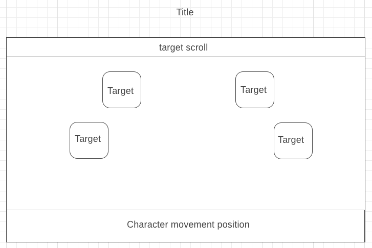

## Shooting Gallery Clone Inspired from Legend of Zelda

### Background

You are a character equipped with a bow and inside of a shop where
you can play a simple shooting game. You are stationed behind a barrier
where you can move left and right. Targets from the gallery will pop
up randomly and can be hit for points.

### Functionality & MVP

Users will be able to

- [ ] move left and right
- [ ] press "A" to shoot a projectile
- [ ] have the projectile hit the target and score points
- [ ] lose points if hitting incorrect target

## Architecture and Technologies
- vanilla Javascript for game logic
- Canvas for animation rendering

'board.js' : sets up the game board, spawn points for targets, and
where the character can move

'character.js' : character logic for moving left and right as well as
firing projectiles

'target.js' : sets up targets to pop up

### Implementation Timeline
**Day 1**:
Learn how to make a simple character sprite move left and right
and fire projectiles "upwards"

**Day 2**:
Render animations for character, targets, and board

**Day 3**:
Game logic and score counter for projectile and target collision

**Day 4**:
Game logic for target pop up intervals and patterns

###Bonus features
- [ ] be able to position character to face left and right and shoot
targets horizontally
