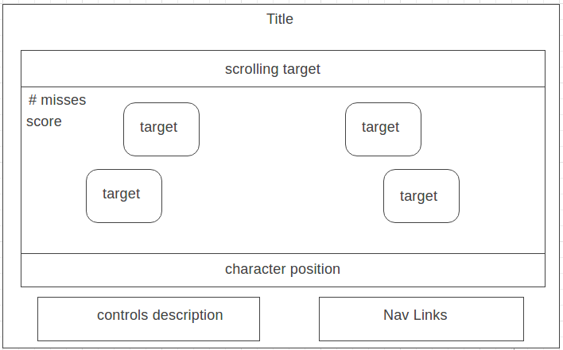

## Shooting Gallery Clone Inspired from Legend of Zelda

### Background

You are a character equipped with a bow and inside of a shop where you can play a simple shooting game. You are stationed behind a barrier where you can move left and right. Targets from the gallery will pop up randomly and can be hit for points. The game will continue until the player misses three shots.

### Functionality & MVP

Users will be able to

- [ ] move left and right
- [ ] press "A" to shoot a projectile
- [ ] have the projectile hit the target and score points
- [ ] lose points if hitting incorrect target
- [ ] game over screen upon 5 missed targets
- [ ] pause game with "q"
- [ ] reset game if pause menu is up

## Wireframes

This is a single screen app with a fixed position. Game controls include arrow keys "left" and "right" with "A" to fire projectiles.

## Architecture and Technologies
- vanilla Javascript for game logic
- Canvas for animation rendering
- webpack to bundle

'board.js' : Sets up the game board, spawn points for targets, and where the character can move. Character can only move left and right at the bottom of the screen

'character.js' : Character logic for moving left and right as well as firing projectiles

'projectile.js' : Projectile logic. Projectile will only move up on the y axis. Each render will subtract projectile position 5 pixels until off screen.

'target.js' : Sets up targets to pop up. Max targets will be kept track of, and each target that pops up will only render for around 2 seconds.

### Implementation Timeline
**Day 1**:
Learn how to make a simple character sprite move left and right and fire projectiles "upwards" along the y axis. Projectiles will also erase after leaving screen dimensions.

**Day 2**:
Render animations for character, targets, and board. Targets will be set in certain positions on the board.

**Day 3**:
Game logic and score counter for projectile and target collision. When the pixels for the projectile overlap with the target projectiles the score will go up.

**Day 4**:
Game logic for target pop up intervals and patterns. Keep track of total number of targets up at a time and randomly send more.

### Bonus features
- [ ] be able to position character to face left and right and shoot
targets horizontally
